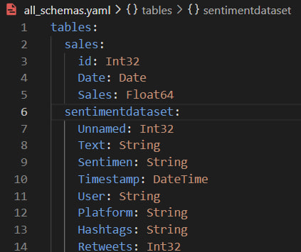
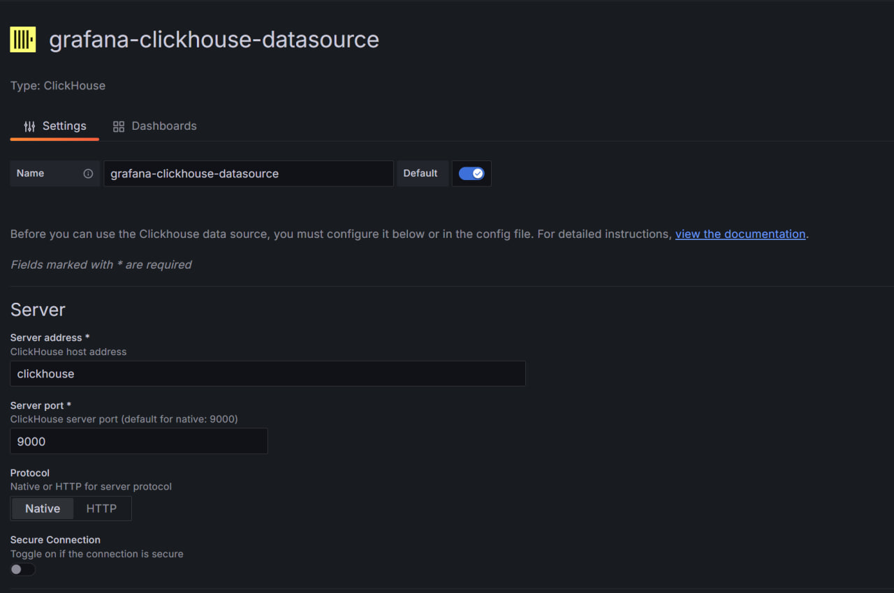
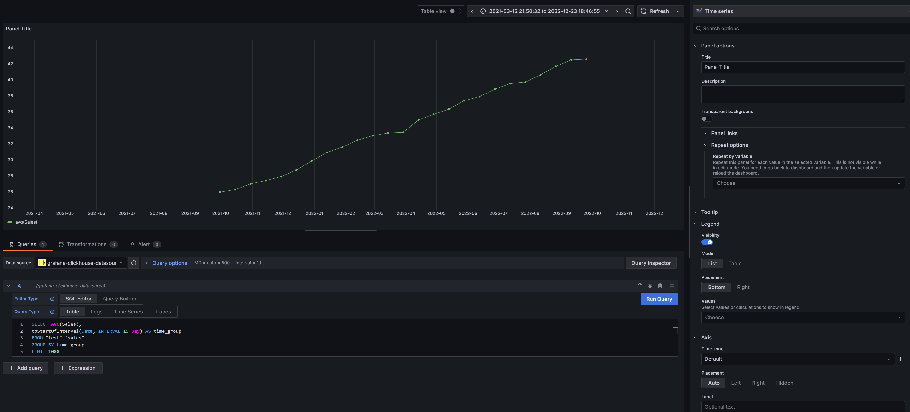

# CSV_VISUAL_GRAFANA 

If you have a csv or excel file and you need to visualize and examine your data, then you will definitely need this repository. 

What do you need to do to get started? 
1. Transfer your file to the datasets folder
2. Enter the names of your columns and the type of data corresponding to them in the configuration file. 
Moreover, if it is not specified in the configuration file, it will be named as position_i (where i is the column number), and the data type will be defined as String. Example: 



3. After that, you need to run Docker Compose

```
docker-compose up -d 
```

4. After that, click on the link to the GRAFANA web data visualization interface: http://localhost:3112
5. Then, you'd create data source. 

6. After that, you can create a visualization using clickhouse dialect.

